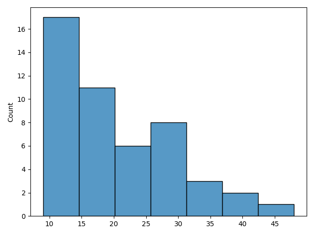
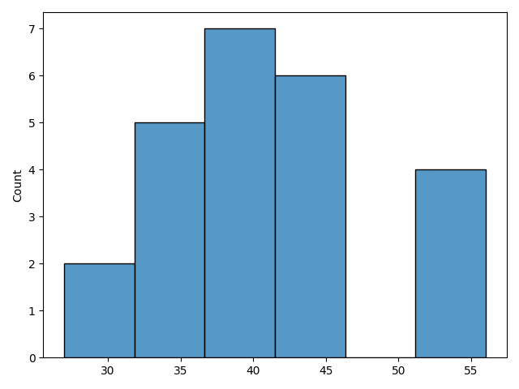
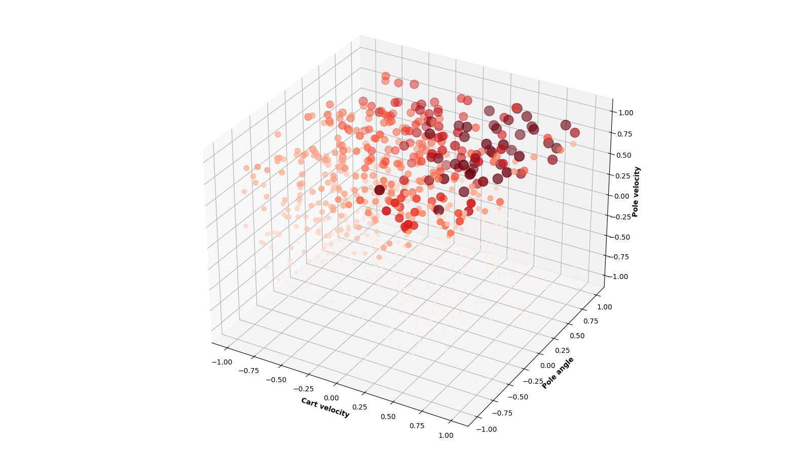
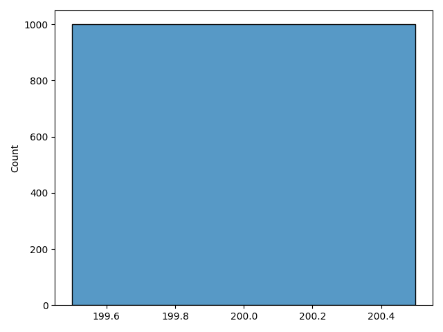
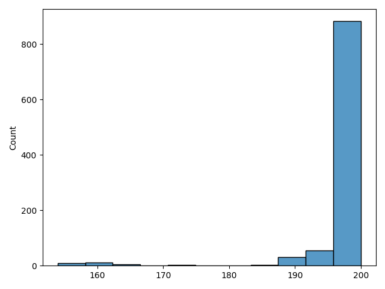

# Search based optimization

## Random actions

average reward of 20.4

## Angle based actions

average reward of 40.8

## Random search based actions
Best weights: [0.04371353 0.07261142 0.2870931  0.59424749]  
Average reward over 1000 epochs: 200  
The two most important weights are the pole velocity and pole angle.  

**Scatter plot**

## Hill climbing
Best weights: [-0.10787198 -0.10338215  3.33474653  0.53108936], resulting in average reward of 200

## Simulated annealing
Best weights: [-4.5025822  20.51093326 41.16732961 21.74916119], resulting in average reward of 200

## Adaptive noise scaling
Best weights: [0.25092723 5.77531716 0.94275653 7.60569827], resulting in average reward of 198

# Conclussion

#### How do these different search algorithms compare to or differ fromeach other in terms of reward and computational efficiency?
The more advanced algorithms are heavier to run and take longer to complete, but they all give great results.
Given you iterate long enough, in this case 1000 times, `random search` returns great results as well.  
In this case I would opt for `random search`. Given it is less computational intensive and still results in a maximum average reward. 
